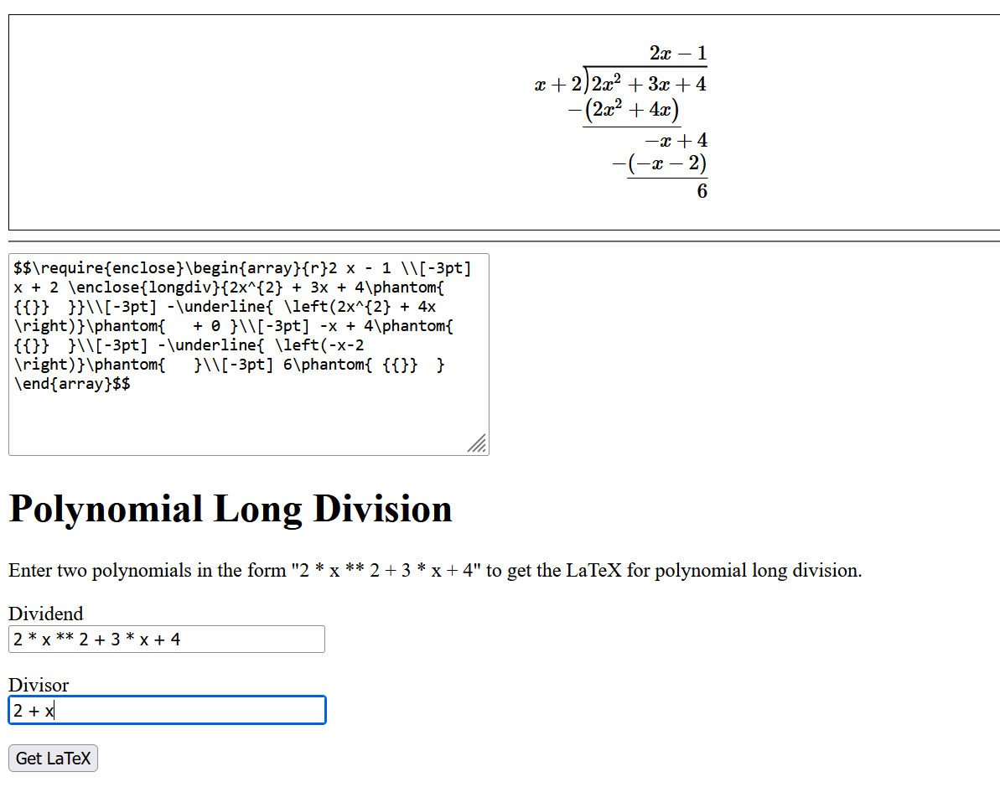

# sme-tools
Tools for generating some common mathematical expressions in LaTeX.

https://chiappinip2.pythonanywhere.com/

(Note: PGF/TikZ doesn't appear to be installable on pythonanwhere anymore so images can only be generated locally.)

## Examples
### Polynomial Long Division

### Generate a Factor Tree

## Running Locally
### Step 1
Go to https://www.tug.org/ and install the appropriate version of LaTeX for your OS. Note you will need the tikz (pgf) package.

### Step 2
Setup your virtual environment then run `pip install -r requirements.txt`

### Step 3
Run the app `python -m flask --app app run`